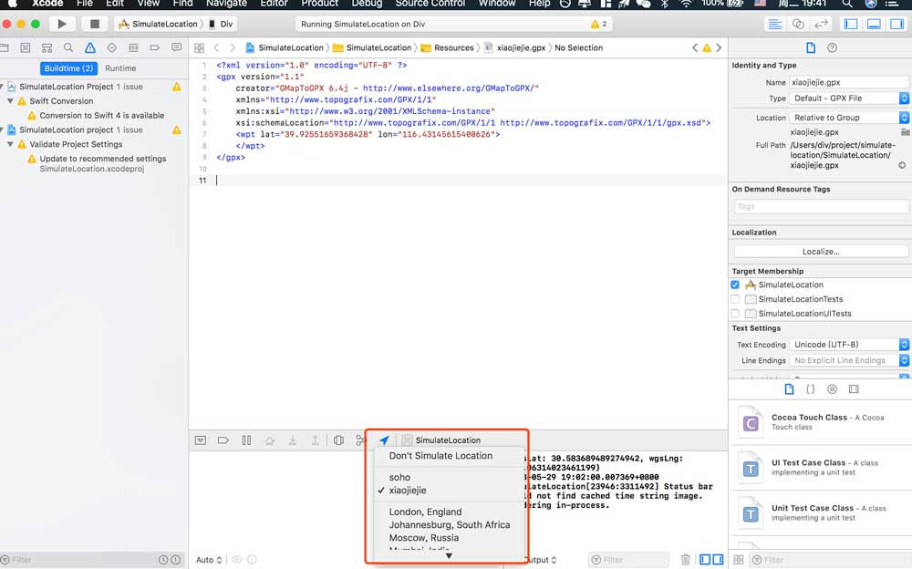

# 破解钉钉打卡

> 本文利用Xcode模拟定位，随时随地打卡，只适用于ios系统。

### 需要解密坐标

这里普及一下坐标系统：
目前我们经常接触是**原始坐标**，**火星坐标**，**二次加密坐标**。
+ 原始坐标：手机上获取到的是原始的GPS坐标 —— **WGS-84**。
+ 火星坐标：我大天朝自己加了飘逸搞的一套加密坐标，中国国测局（和GFW一样的傻屌组织）—— **GCJ-02**：**谷歌**、**高德**。
+ 百度加密坐标：在火星坐标的基础上再次飘逸后的加密坐标 —— **BD-09**：**百度**。
这里我们需要将 **GCJ-02** 和 **BD-09** 转换成 **WGS-84**
网上有模拟算法，但是不能保证100%精准-[eviltransform算法](https://github.com/googollee/eviltransform.git)。

### 获取坐标

坐标获取入口：
+ [高德](http://lbs.amap.com/console/show/picker)
+ [百度](http://api.map.baidu.com/lbsapi/getpoint/index.html)

首先，根据各自的喜好，选好你想要模拟的位置，这里以高德地图**望京soho**原始坐标为例：

+ 高德地图上望京soho的**GCJ-02**坐标：
```
116.48105,39.996794
```

+ 我们使用最新[eviltransform.gcj2wgs](https://github.com/googollee/eviltransform/tree/master/javascript#gcjtowgsgcj2wgs)方法转换出所需要的**WGS-84**坐标。（百度地图使用[eviltransform.bd2wgs](https://github.com/googollee/eviltransform/tree/master/javascript#%E7%99%BE%E5%BA%A6bd-09)方法）

+ 解密后的**WGS-84**坐标：
```
116.47496089091223,39.995513178011876
```


### 运行项目
clone项目 [simulate-location](https://github.com/div-wang/simulate-location)

#### 项目里新建gpx文件
这里我们需要新建一个 **gpx** 文件，也可以用项目目前默认的，包含坐标用于模拟定位。
```xml
<?xml version="1.0" encoding="UTF-8" ?>
<gpx version="1.1"
    creator="GMapToGPX 6.4j - http://www.elsewhere.org/GMapToGPX/"
    xmlns="http://www.topografix.com/GPX/1/1"
    xmlns:xsi="http://www.w3.org/2001/XMLSchema-instance"
    xsi:schemaLocation="http://www.topografix.com/GPX/1/1 http://www.topografix.com/GPX/1/1/gpx.xsd">
    <wpt lat="39.995513178011876" lon="116.47496089091223">
    </wpt>
</gpx>
```
把转换得到的 **GCJ-02** 坐标对应到 **lat** 和 **lon** 里面即可。

#### 真机运行
+ xcode真机运行项目，在`run`起来之后，点击`debug > simulate location > soho`就切换到该坐标定位了。
+ 或者点击控制台定位图标：



#### 随时随地打卡
+ 这个时候千万别点**Stop**，**Home**键后台，然后直接拔掉数据线即可（猜测是Xcode开发者模式开了个进程来模拟定位，如果Xcode上没有Stop，那这个进程就不会Kill掉）。
+ 亲测模拟定位是有时效的，一般是2-4天，超过了再重新`run`一遍就可以了。

#### 还原定位
+ 恢复方法最直接的是重启手机还原定位。
+ 也可以用xcode再`run`一次，然后直接 **Stop** 即可。

### 破解钉钉WiFi打卡
如果公司只配置校验了SSID，没有校验DHCP地址，把家里的WiFi名称改得和公司打卡的WiFi即可。  
公司如果启动了DHCP校验，需要把手机的IP地址配置的和公司的一样，一般是： `192.168.1.*`。  
获取方法: `设置 > 无线局域网 > 链接的wifi名 > ip地址`
